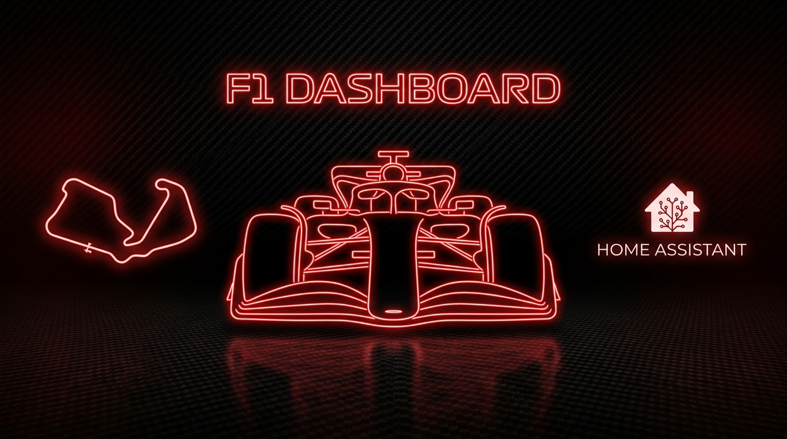

# F1 Dashboard Integration

[](https://github.com/hacs/integration)
[](https://my.home-assistant.io/redirect/hacs_repository/?owner=alexw8702&repository=ha-f1-dashboard&category=integration)
[](https://github.com/alexw8702/ha-f1-dashboard/releases)

Formel-1-Daten für Home Assistant, komplett kostenlos ohne API-Key.



> **Hinweis:** Die passenden Dashboard-Karten leben in einem separaten Repo: [**ha-f1-dashboard-card**](https://github.com/alexw8702/ha-f1-dashboard-card) (HACS-Kategorie *Dashboard/Plugin*). Beide Repos werden getrennt installiert, da HACS pro Repo nur eine Kategorie gleichzeitig verwaltet.
>
> **Versionsstand:** Integration `v0.5.0-beta.1` · Card `v0.6.5-beta.2`. Die Card wurde in v0.4.0 auf Vue 3 umgestellt und die Rennwochenende-Karte neu designt. Seit Integration v0.5.0-beta.1 / Card v0.6.5-beta.x zeigt die Session Card eine Timing-Tabelle (aus `sensor.f1_dashboard_live_timing_tower` während einer laufenden Session, sonst aus `sensor.f1_dashboard_letzte_session`) sowie die Startaufstellung inkl. Strafen-Kennzeichnung (`sensor.f1_dashboard_startaufstellung`); `live_track_positionen` und `live_streckenstatus` bleiben weiterhin nur für eigene Automationen/Templates/Custom-Karten nutzbar, ohne eigene Darstellung in der Session Card.

---

## Features der Integration

### 📋 Sensoren für Wertungen
- **Fahrer-WM**: Position, Punkte, Team, Teamfarbe, Nummer
- **Konstrukteurs-WM**: Position, Punkte, Teamfarbe

### 🏁 Session & Rennwochenende
- **Session-Status**: Aktuelle Session (FP1–FP3, Quali, Sprint, Rennen), Countdown zur nächsten Session
- **Rennkalender**: Nächstes Rennwochenende und die von Jolpica gelieferten Strecken- und Sessiondaten
- **Wetter**: 4-Tages-Vorhersage + stündlicher Verlauf (Temperatur, Regen, Wind) für die Rennstrecke — nützlich für eigene Automationen; die mitgelieferte Session Card lädt ihr Wetter seit Card-v0.4.0 direkt im Frontend und benötigt diesen Sensor nicht mehr zwingend

### 🚗 Live-Timing (nur während aktiver Sessions)
- **Live-Streckenkarte**: Sensor mit Echtzeitpositionen aller 22 Fahrer (X/Y/Z, Bounds, Streckenstatus) — Rohdaten für eigene Visualisierungen, aktuell ohne Standard-Card
- **Flaggen-Logik im Sensor-Attribut**:
  - 🟢 **Grün**: Normale Darstellung
  - 🟡 **Gelb**: Normale Darstellung
  - 🚗 **Safety Car**: Status `4`
  - 🚨 **Rote Flagge**: Status `5`
  - 🟡 **VSC**: Status `6`
- **Timing Tower**: Position, Team, Gap zum Leader, letzte Rundenzeit, Box-/Out-Status je Fahrer
- **Live-Streckenstatus**: Grün/Gelb/Safety Car/Rot/VSC
- **Renn-Kontrollnachrichten**: Flaggen, Strafen, Untersuchungen (ausgewählte Events)
- **Datenquelle**: Offizielle F1-Live-Timing-Feed per WebSocket (livetiming.formula1.com), unauthentifiziert, automatischer Start/Stop je nach Session-Status

> Diese Live-Sensoren sind weiterhin Teil der Integration und aktiv nutzbar — sie sind lediglich (Stand Card v0.4.0) nicht mehr in die mitgelieferte `f1-session-card` eingebunden. Wer sie visuell nutzen möchte, kann eigene Karten/Templates auf Basis dieser Entities bauen oder vorerst Card-Version v0.3.0 verwenden.

### 📹 Letztes Rennen
- **Endergebnis**: DNF/DNS/DSQ-Status, Rückstand zum Sieger
- **Reifen-Strategie**: Pro-Fahrer-Compound-Anzeige (Rot/Gelb/Weiß nach F1-Standard)
- **Boxenstopps**: Anzahl und Dauer (via OpenF1-API, optional deaktivierbar)

---

## Installation

### 1. Integration installieren (YAML-frei, UI-Setup)

1. **HACS öffnen** → oben rechts ⋮ → **Benutzerdefinierte Repositories**
2. Diese Repo-URL einfügen: `https://github.com/alexw8702/ha-f1-dashboard`
3. Kategorie: **Integration** → **Hinzufügen**
4. Nach „F1 Dashboard" suchen → **Herunterladen**
5. **Home Assistant neu starten** (wichtig: Python-Komponenten laden)
6. **Einstellungen → Geräte & Dienste → Integrationen** → **Integration hinzufügen** → „F1 Dashboard" suchen
7. Optional: Live-Wetter oder Rennrückblick deaktivieren → **Absenden**

Alle Sensoren werden automatisch erstellt.

### 2. Karten installieren (separate Installation)

1. **HACS → Frontend (Dashboard)** → ⋮ → **Benutzerdefinierte Repositories**
2. Repo-URL: `https://github.com/alexw8702/ha-f1-dashboard-card`
3. Kategorie: **Dashboard/Plugin** → **Hinzufügen**
4. Nach „F1 Dashboard Card" suchen → **Herunterladen**
5. **Browser hart neu laden** (Strg+Shift+R)

> HACS legt die Ressource automatisch an. Falls nicht, unter *Einstellungen → Dashboards → ⋮ → Ressourcen* prüfen:
> `/hacsfiles/ha-f1-dashboard-card/f1-dashboard-card.js` als **JavaScript-Modul**.

---

## Verwendung in Dashboards

Alle vier Karten sind in [**ha-f1-dashboard-card**](https://github.com/alexw8702/ha-f1-dashboard-card) definiert. Beispiel-Dashboard:

```yaml
type: vertical-stack
cards:
  - type: custom:f1-session-card
    entity: sensor.f1_dashboard_session_status

  - type: custom:f1-drivers-card
    entity: sensor.f1_dashboard_fahrerwertung
    max: 10

  - type: custom:f1-constructors-card
    entity: sensor.f1_dashboard_konstrukteurswertung
    max: 10

  - type: custom:f1-race-recap-card
    entity: sensor.f1_dashboard_letztes_rennen_detail
```

> Seit Card-v0.4.0 genügt für `f1-session-card` die reine `entity`-Angabe; Wetter wird automatisch im Frontend geladen.

---

## Entities der Integration

Nach der Einrichtung sind folgende Sensoren verfügbar:

| Entity-ID | Name | Zweck |
|-|-|-|
| `sensor.f1_dashboard_fahrerwertung` | Fahrer-WM | WM-Stand (JSON: Position, Punkte, Team, Teamfarbe, Nummer) |
| `sensor.f1_dashboard_konstrukteurswertung` | Konstrukteurs-WM | Team-WM-Stand (JSON: Position, Punkte, Teamfarbe) |
| `sensor.f1_dashboard_rennkalender` | Rennkalender | Saison, Rennwochenenden und Sessiondaten |
| `sensor.f1_dashboard_letztes_ergebnis` | Letztes Ergebnis | Rohes Jolpica-Rennergebnis für Automationen/Templates |
| `sensor.f1_dashboard_letztes_qualifying` | Letztes Qualifying | Rohes Jolpica-Qualifying für Automationen/Templates |
| `sensor.f1_dashboard_session_status` | Session-Status | Aktuelle Session, Countdown, Nächste Session |
| `sensor.f1_dashboard_wetter_vorhersage` | Wetter Vorhersage | Tägliche Vorhersage am nächsten Circuit (optional, für Automationen) |
| `sensor.f1_dashboard_wetter_stuendlich` | Wetter stündlich | Stündliche Vorhersage am nächsten Circuit (optional, für Automationen) |
| `sensor.f1_dashboard_live_streckenstatus` | Live Track Status | (Live) Flaggenstatus, nur während Sessions — derzeit ohne Card-Anbindung |
| `sensor.f1_dashboard_live_timing_tower` | Live Timing Tower | (Live) Alle Fahrer: Position, Gap, Rundenzeit, Box-Status — derzeit ohne Card-Anbindung |
| `sensor.f1_dashboard_live_renn_kontrolle` | Live Renn-Kontrolle | (Live) jüngste Flaggen, Strafen und Untersuchungen — derzeit ohne Card-Anbindung |
| `sensor.f1_dashboard_live_track_positionen` | Live Track Positionen | Echtzeitpositionen aller Fahrer (X/Y/Z), Bounds, Streckenstatus — derzeit ohne Card-Anbindung |
| `sensor.f1_dashboard_letztes_rennen_detail` | Letztes Rennen (Detail) | Endergebnis, Reifen-Strategie, Boxenstopps (24h nach Rennen verfügbar) |
| `sensor.f1_dashboard_letzte_session` | Letzte Session | Timing-Ergebnis der zuletzt gestarteten (laufenden oder abgeschlossenen) Session — FP1-3/Sprint/Quali/Rennen, flach aufbereitet — derzeit ohne Card-Anbindung |
| `sensor.f1_dashboard_startaufstellung` | Startaufstellung | Startaufstellung des aktuellen Wochenendes inkl. Strafen-Kennzeichnung; vor dem Rennen provisorisch (= Quali-Reihenfolge) — derzeit ohne Card-Anbindung |

### Attribute des `live_track_positionen`-Sensors

```python
# state: "Live Track Positions"
# attributes: {
#   "positions": [
#     {"driver_number": 1, "tla": "VER", "team_colour": "#1e3050", "x": 1234.5, "y": 567.8, "status": "OnTrack"},
#     # ... alle Fahrer
#   ],
#   "bounds": {"min_x": 500, "max_x": 2500, "min_y": 200, "max_y": 1800},
#   "track_status": 1  # 1=Grün, 2=Gelb, 4=SC, 5=Rot, 6=VSC, 7=VSC-Ende
# }
```

---

## Datenquellen

| Daten | API | Authentifizierung | Rate-Limit |
|-|-|-|-|
| Fahrer, Teams, Strecken, Wertungen | Jolpica-F1 (Ergast-kompatibel) | Keine | Großzügig |
| Live-Timing, Positionen, Flags | F1 Live Timing Feed (SignalR Core) | Keine (öffentlich) | N/A (WebSocket) |
| Wetter | Open-Meteo | Keine | 10.000/Tag |
| Boxenstopps, Reifen | OpenF1 | Keine | Großzügig |

**Wichtig**: Alle APIs sind **kostenlos** und erfordern **keinen API-Key**.

---

## Konfiguration (nach Installation)

Die Integration wird über die UI konfiguriert. Zum Anpassen später:
**Einstellungen → Geräte & Dienste → F1 Dashboard → ⚙️ Konfigurieren**

Optionen:
- **Live-Wetter aktiviert**: An/Aus (Standard: An)
- **Rennrückblick aktiviert**: An/Aus (Standard: An)

---

## Changelog

### v0.5.0-beta.2
- ✨ **`sensor.f1_dashboard_startaufstellung`: `quali_time` und `sector_1`/`sector_2`/`sector_3` pro Fahrer**, für die zusammengeführte Quali-/Grid-Detailansicht beim Klick auf einen Fahrer im Karten-Frontend. `quali_time` ist die bereits vorhandene beste Qualifying-Rundenzeit (Q3, sonst Q2, sonst Q1). Die Sektorzeiten gibt es bei Jolpica/Ergast gar nicht — sie kommen neu über OpenF1s `/v1/laps`-Endpunkt (ein einziger Abruf für alle Fahrer, kein Abruf pro Fahrer), gewählt wird je Fahrer die schnellste gültige Qualifying-Runde (Boxenausfahrten und Runden ohne Rundenzeit werden ausgeschlossen). Wie die Startaufstellung selbst wird auch dieser Abruf pro Qualifying-`session_key` nur einmal erfolgreich durchgeführt und danach zwischengespeichert, um nicht bei jedem stündlichen Poll erneut die komplette Rundenliste zu laden. Ohne verfügbare OpenF1-Daten bleiben die Felder `null`.
- ✅ **Testsuite erweitert** um die neue Sektorzeiten-Logik (inkl. des neuen `/v1/laps`-Endpunkts), jetzt **119 Tests**.

### v0.5.0-beta.1
- ✨ **Neuer Sensor `sensor.f1_dashboard_letzte_session`**: Flaches Timing-Ergebnis der zuletzt gestarteten (laufenden oder abgeschlossenen) Session eines Rennwochenendes — Training, Sprint, Qualifying oder Rennen. Qualifying/Rennen werden aus den bestehenden Jolpica-Daten aufbereitet; Training/Sprint kommen über einen neuen generischen OpenF1-Session-Lookup (`api.async_find_session`), da Jolpica/Ergast dafür keine Ergebnisse führt.
- ✨ **Neuer Sensor `sensor.f1_dashboard_startaufstellung`**: Startaufstellung des aktuellen Rennwochenendes inkl. Strafen-Kennzeichnung (`penalty`/`penalty_note`) pro Fahrer. Nutzt jetzt OpenF1s `/starting_grid`-Endpunkt, der laut OpenF1-Doku bereits wenige Minuten nach Veröffentlichung der offiziellen Ergebnisse befüllt wird — i.d.R. schon kurz nach dem Qualifying inkl. etwaiger FIA-Startplatzstrafen, nicht erst nach dem Rennen. `provisional: true` (= reine Qualifying-Reihenfolge ohne bekannte Strafen) greift dadurch nur noch im kurzen Zeitfenster direkt nach dem Qualifying, bevor OpenF1 diese Daten eingepflegt hat; sobald das Rennen selbst gefahren wurde, hat das tatsächliche `grid`-Feld aus dem Jolpica-Rennergebnis weiterhin Vorrang als garantiert authoritative Quelle.
- ✨ **`penalty_note` jetzt auch ohne aktive Live-Session verfügbar**: Zusätzlich zur bisherigen Live-Race-Control-Texterkennung wird jetzt OpenF1s `/race_control`-Endpunkt historisch (per `session_key`) abgefragt und über die strukturierte `driver_number` zugeordnet — kein Rateversuch mehr wie bei der reinen Freitext-Suche, funktioniert also auch, wenn niemand die Session live verfolgt hat.
- ✅ **Testsuite erweitert** um die neue Session-Auswahl-/Grid-/Strafenerkennungs-Logik (inkl. der beiden neuen OpenF1-Endpunkte), jetzt **112 Tests**.

### v0.4.4
- 📦 **Ausschluss hochfrequenter Attribute vom Recorder**: Die Attribute `drivers` (Timing Tower) und `messages` (Race Control) der Live-Sensoren werden nun wie auch schon `positions`/`bounds` nicht mehr in der Home Assistant SQL-Datenbank aufgezeichnet, um extremes Datenbank-Wachstum während der Sessions zu verhindern.
- 🔒 **API-Robustheit erhöht**: Ungültige Payloads (z. B. fehlerhafte JSON-Formate) bei Verbindungsabbrüchen oder unvollständigen JSON-Rückgaben der OpenF1/Jolpica APIs werden nun als `F1ApiError` abgefangen. Die OpenF1-Endpunkte fallen zudem bei unstrukturierten Antworten sauber auf Standardwerte zurück, um Ausfälle der Integration zu verhindern.
- ✅ **Testsuite erweitert**: Die Testsuite wurde um API-Robustheitsprüfungen erweitert und umfasst nun **94 Tests**.

### v0.4.3
- ⚡ **OpenF1-Rennrückblick wird nicht mehr stündlich pauschal neu abgerufen.** Der Abruf erfolgt jetzt nur noch bei der Erstinitialisierung und wenn sich das letzte Rennergebnis oder der Session-Status ändert — vorher wurde die ohnehin rate-limitierte OpenF1-API bei jedem stündlichen Poll-Zyklus erneut abgefragt, auch wenn sich nichts geändert hatte. Schlägt ein Neu-Abruf fehl (z. B. Rate-Limit), bleibt der zuletzt bekannte gute Stand erhalten statt geleert zu werden.
- 🐛 **Bugfix:** Ein unvollständiger OpenF1-Rückblick (leere Ergebnisse kurz nach Rennende, bevor OpenF1 die Daten vollständig eingepflegt hat) wurde fälschlich dauerhaft zwischengespeichert und blieb bis zum nächsten Rennwochenende unvollständig stehen. Der Cache wird jetzt nur noch committet, wenn tatsächlich Ergebnisse vorliegen; sonst versucht der nächste stündliche Zyklus automatisch erneut.
- 🐛 **Bugfix:** `sensor.f1_dashboard_session_status` (aktuelle Session, Countdown, Wochenendplan) konnte bis zu 59 Minuten hinter der Realität zurückhängen — die minütliche Prüfung, die pünktlich die Live-Timing-Verbindung startet, aktualisierte den Sensor selbst nicht mit, sondern nur einen internen Zwischenstand. Der Sensor zieht jetzt innerhalb der gleichen Minute nach.
- ✅ **Testabdeckung auf `config_flow.py` und `__init__.py` erweitert** (Einrichtungsdialog und Setup-/Unload-/Reload-Lebenszyklus) — laut Repo-Review die einzigen beiden Module ohne jegliche Testabdeckung. Inklusive der beiden obigen Bugfixes jetzt 92 Tests gesamt.

### v0.4.2
- 🧹 **Doku-/Code-Aufräumen:** Nie genutzte Konstanten (`UPDATE_INTERVAL_CALENDAR`/`WEATHER`/`OPENF1`) entfernt, die eine granulare Polling-Strategie suggerierten, welche es nie gab (tatsächlich pollt ein einziger Coordinator alles stündlich). Der an Jolpica/OpenF1/Open-Meteo gesendete `User-Agent`-Header war seit dem allerersten Release bei `0.1.0` eingefroren, entspricht jetzt der aktuellen Version. Keine funktionale Änderung.

### v0.4.1
- ✅ **CI führt jetzt die Testsuite aus:** Bisher validierte die CI nur die Python-Syntax; die 67 Unit-Tests unter `tests/` liefen nur bei manuellem Aufruf. Neuer CI-Job führt sie bei jedem Push/PR aus. Keine funktionale Änderung an der Integration.

### v0.4.0
- 🐛 **Bugfix (Rennrückblick):** OpenF1-Fahrer ohne eigene Position (nicht mit Jolpica-Ergebnissen abgleichbar) wurden fälschlich mit Position 0 vor dem bekannten Sieger einsortiert. Fallback jetzt korrekt hinten (999) statt vorne (0).
- 📚 **Sensor-Dokumentation bereinigt:** Die veröffentlichte Entitätsliste entspricht nun den tatsächlich erzeugten Sensoren. Nicht existente bzw. veraltete Namen wurden entfernt; Kalender-, Ergebnis-, Qualifying-, Wetter- und Live-Rennkontrollsensoren sind vollständig dokumentiert.
- 🔗 **Datenvertrag vereinheitlicht:** Der Rennrückblick wird als `sensor.f1_dashboard_letztes_rennen_detail` dokumentiert und passt damit zum Standard der Frontend-Karte.
- ✅ **Testsuite massiv erweitert** (9 → 67 Tests): Sensor-Attribut-Verträge (insbesondere die `standings`-Flattening-Logik für die Vue-3-Karten), Live-Timing-Nachrichtenverarbeitung, SignalR-Frame-Parsing sowie zusätzliche API-/Coordinator-Randfälle inkl. Regressionstest für den Positions-Fix. Keine funktionale Änderung außer dem genannten Bugfix, aber deutlich höhere Absicherung gegen künftige Regressionen bei den drei unversionierten externen APIs (Jolpica, OpenF1, F1-Live-Timing-Feed).

### v0.3.2
- 🔧 **Bugfix (Lovelace Card-Kompatibilität)**: 
  - Die Sensoren für die Fahrer- und Konstrukteurswertung befüllen nun das flache `standings`-Attribut, das von den neuen Vue-3-Karten (v0.4.0) benötigt wird, um leere Listen (0 Fahrer) zu beheben.
  - Die Daten des Rennrückblicks (`results`, `stints`, `pit_stops`) werden nun serverseitig aufbereitet und mit den Klarnamen und Teams aus Jolpica/Ergast angereichert, um leere Tabellen und die JS-typische `"Object"`-Anzeige der Konstrukteure zu korrigieren.

### v0.3.1
- 🔧 Kleinere Fixes und Stabilisierung der bestehenden v0.3.0-Sensoren
- 🎯 Kompatibilitäts-Hinweis: Card-Repo ist ab jetzt unabhängig versioniert (aktuell v0.4.0) und bindet die Live-Sensoren dieser Integration vorübergehend nicht mehr standardmäßig ein

### v0.3.0 (Live-Streckenkarte)
- ✨ **Live-Streckenkarte**: Neuer Sensor `live_track_positionen` mit Echtzeit-Fahrzeugpositionen (X/Y/Z)
- 🎨 Canvas-Rendering: Fahrspuren zeichnen automatisch das Streckenlayout
- 🚩 Flaggen-Logik: Rote Flagge blendet Fahrer aus, SC/VSC friert ein, jeweils mit Overlay
- 📍 Automatische Bounds-Berechnung aus Live-Daten, Garage-Einträge gefiltert
- 🔄 Position.z-Topic des F1-Live-Timing-Feeds abonniert (base64/raw-DEFLATE-kodiert)
- 🛠️ **Wichtig**: Live-Wetter und Live-Timing-Daten nur während Sessions aktiv
- 📦 Alle Positionen-Attribute vom Home Assistant Recorder ausgenommen (Performance)

### v0.2.1
- Jolpica-F1 API als neue Quelle (schneller, zuverlässiger)
- Alle Sensoren via UI eingerichtet (kein YAML mehr nötig)
- Wetter-Vorhersage für Rennstrecken

### v0.2.0
- Live-Timing-Sensor (Timing Tower)
- Streckenfakten-Sensor
- Live-Streckenstatus (Flaggen)

---

## Troubleshooting

### Live-Daten erscheinen nicht

1. **Ist gerade eine Session aktiv?** Live-Sensoren sind nur während FP1–Rennen aktiv.
2. **HA-Logs prüfen**: `Einstellungen → System → Protokolle → custom_components.f1_dashboard` auf Debug setzen
3. **WebSocket-Verbindung prüfen**: livetiming.formula1.com/signalrcore sollte erreichbar sein

### Live-Sensoren sind gefüllt, aber ich sehe nichts in der Session Card

Das ist seit Card-v0.4.0 erwartet: Die neu gestaltete `f1-session-card` bindet die Live-Streckenkarte und den Timing Tower derzeit nicht mehr standardmäßig ein. Die Sensordaten selbst sind unter *Entwickler-Tools → Zustände* weiterhin einsehbar und können in eigenen Karten/Templates verwendet werden.

### Fehlerhafte Streckenfakten

Die Strecke ist möglicherweise nicht in der Datenbank. [Issue öffnen](https://github.com/alexw8702/ha-f1-dashboard/issues) mit Rennwochenende-Info.

---

## Lizenz

MIT License — siehe [LICENSE](LICENSE)

---

## Credits

- **Daten**: Jolpica-F1, F1 Official Live Timing, Open-Meteo, OpenF1
- **Inspiriert von**: [FastF1](https://github.com/theOehrly/Fast-F1)

---

Dieses Projekt ist inoffiziell und steht in keiner Verbindung zu Formula 1, der FIA oder verbundenen Unternehmen. F1, FORMULA 1 und zugehörige Marken sind Eigentum von Formula One Licensing B.V.

**Gutes Rennen! 🏁**
